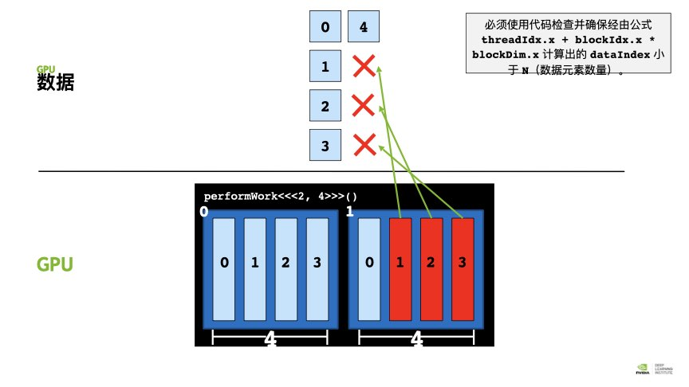

## CPU 架构

cpu中较多的晶体管用于数据缓存和流程控制, 只拥有几个少数的高速计算核心. 

- Fetch/Decode: 取指令、译码单元
- ALU(Arithmetic Logic Unit): 算术逻辑单元
- Execution Context: 执行上下文池
- Data cache: 数据缓存
- 流水线优化单元: 如乱序执行、分支断定预测、memory预存取等。


<div style="text-align: center;">课件截图</div>

## 单核（少核）处理器发展的物理约束

$$
P = C * V ^{2} * f
$$

P 为功耗， V是电压，C是和制程有关的一个常数项，f是时钟频率。

1. 制程极限：量子隧穿。
2. 时钟频率墙：处理器的时钟频率无法保持线性的增长。
3. 存储墙：虽然提高晶体管集成度可以增加处理数据的速度，但是从存储单元读取数据的速度却也是瓶颈。

解决方案之一：
多核心，并行计算。

## GPU 架构

1. 拥有更高的算力
2. 拥有更大的数据传输带宽


<div style="text-align: center;">课件截图</div>

- 图中的深浅黄色叠加的小方块，表示的是一个SIMD function unit。（Single Instruction Multiple Data，单指令多数据流，能够复制多个操作数，并把它们打包在大型寄存器的一组指令集。
  ）。Control shared across 16 units(1 MUL-ADD per clock)
  
- Groups of 32[CUDA Threads/fragments/vertices] shared in an instruction stream.

- Up to 48 groups are simultaneously interleaved。

- Up to 1536 individual contexts can be stored。


<div style="text-align: center;">课件截图</div>

SM: Stream Multi-Processor。SM的核心组件包括多个cuda core, 共享的内存，一些寄存器等。SM可以并发执行数百个线程，
并发能力取决于SM中包含的cuda core（也就是streaming processor）的数量。
Fermi架构GF100是32个，GF10x是48个。Kepler架构都是192个，Maxwell都是128个。
kernel启动后，threads会被分配到多个SM中执行，，但是同一个block中的threads必然在同一个SM中并行（逻辑层面）执行。

Warp: 32 CUDA Cores。 一个Warp代表了在物理层面，一起同时执行同一个指令的核心们。（虽然逻辑层面我们认为所有thread是并行执行的，但是其实只有一个Warp中的threads在物理层面算是同时执行）
一个warp包含32个并行thread，这32个thread执行于SMIT模式。也就是说所有thread执行同一条指令，
并且每个thread会使用各自的data执行该指令。

warp是调度和运行的基本单元。一个warp需要占用一个SM运行，多个warps需要轮流进入一个SM, 由SM硬件层面的warp scheduler
负责调度。

**冷知识**：市面上买来的显卡，体积和质量大部分是在风扇和对应的电机，处理器芯片本身的质量是较小的。

## 并行计算简介

- 使用多个计算资源，解决一个计算问题。
- 通信和计算的开销比例要合适。
- 不要受制于访存带宽。

## Amdahl's Law

程序的可能的加速比，取决于可以被并行化的部分：

Speed Up Rate = 1 / (1 - P) 其中， P代表了可以被并行化的部分所占的用时的比例。

如果用N个处理器并行处理：

Speed Up Rate = 1 / (S + (P / N)) 其中，N代表了处理器数量，P是可以并行的部分，S表示串行的部分。


并行化的可扩展行有极限：

|N    |P=0.5|P=0.9|P=0.99|
| --- | --- | --- | ---  |
| 10  | 1.82 | 5.26 | 9.17  |
| 100  | 1.98 | 9.17 | 50.25  |
| 1000  | 1.99 | 9.91 | 90.99  |
| 10000  | 1.99 | 9.91 | 99.02 |


## 初识CUDA

异构计算：简单来说就是将不同的内容分配到不同的设备上进行计算。

- 逻辑控制：CPU。将CPU和内存称作Host。
- 密集计算：GPU。将GPU和显存称作Device。

CUDA安装后如何查看设备中的GPU状态：

- 个人电脑，工作站： nvidia-smi
- Jetson：jtop

CUDA安装后，有很多的sample示例在起安装的文件夹下，可以自行编译，运行，学习。

下图是一个在jetson nano上运行cuda示例程序的一个截图，该程序是用来查看设备各项特性的。


<div style="text-align: center;">截图</div>

下图是一个在作者装有2060显卡上运行同样的示例程序的截图:


<div style="text-align: center;">截图</div>

对比之下，是能看出两种设备的资源差异的。


## CUDA编程

编程模式：Extended C


<div style="text-align: center;">课件截图</div>

1. 数据从内存复制到显存。
2. 数据从显存缓存到处理器上，加载GPU程序，执行程序，将结果保存在显存。
3. 将计算结果从显存复制到内存。

何为CUDA的kernel? 以下是摘自CUDA programming guide的一个简介：

"CUDA C++ extends C++ by allowing the programmer to define C++ functions,
 called *kernels*, that, when called, are executed N times in parallel by N different *CUDA threads*,
 as opposed to only once like regular C++ functions.

A kernel is defined using the `__global__` declaration specifier and the number of CUDA threads that
execute that kernel for a given kernel call is specified using a new `<<<...>>>`*execution configuration* syntax
(see [C++ Language Extensions](https://docs.nvidia.com/cuda/cuda-c-programming-guide/index.html#c-language-extensions)).
Each thread that executes the kernel is given a unique *thread ID* that
is accessible within the kernel through built-in variables "threadIdx"."


Declspecs

```
__device__: 执行空间说明符，功能为:
  - 明确函数需在设备上执行
  - 只能从设备调用
  - __global__和__device__执行空间说明符不可以一起使用
    
__global__: 执行空间说明符，将函数声明为核函数。功能为:
  - 明确函数需在设备上执行
  - 可从主机调用
  - 它修饰的函数必须具有void返回值
  - 对__global__函数的任何调用，都必须指定其执行配置
  - 对__global__函数的调用时异步的，这意味着它在设备完成执行前会返回
  
__host__: 执行空间说明符，功能为:
  - 明确函数需在主机上执行
  - 只能从主机上调用
  - __global__ 和 __host__ 不能一起使用。但是 __device__ 和 __host__ 可以一起使用，在这种情况下，该函数是为主机和设备编译的。
  - 问题: 既然是在主机上执行和调用，和普通的函数有什么区别。这是因为，有些函数，可能既想运行在device端，也想运行在host端，那么如果没有__host__
  说明符，就需要定义两个相同的函数，为在device端运行的加上__device__修饰符，这样做起来有些冗余。因此，就有了__host__就可以让它和__device__说明
  符一起使用，修饰同一个函数，那么编译的时候就会分别为host端和device端都编译一份。
    
__shared__
__local__
__constant__
  ...
```

关键字

```C
threadIdx
blockIdx
```

Intrisics

```c
__syncthreads
```

运行期API

```
Memory: cudaMalloc
symbol

```

## 撰写Makefile需要注意的点

如果有文件名和make的指令重名，只需要再撰写makefile的时候（例如课上演示的存在一个名为clean的文件）,
需为重名的指令加上`.PHONY: xxx` 例如（`.PHONY: clean`）即可。

## CUDA程序的编译


<div style="text-align: center;">课件截图</div>

不同型号的GPU对应了不同类型的架构，因此也对应了不同的编译参数:
关键点：--gpu-architecture参数需要 **小于** --gpu-code


<div style="text-align: center;">课件截图</div>

关于如何确定自己机器上GPU的architecture, 建议直接搜显卡的型号查看。也有人建议可以使用 cuda device prop查询，但是作者目前为止还没有完全搞明白具体的做法。


nvcc的一些参数，可以通过`nvcc --help` 来查看:

例如，课程示例中涉及到的`--device-c`

  ```
  --device-c                                      (-dc)
          Compile each .c/.cc/.cpp/.cxx/.cu input file into an object file that contains
          relocatable device code.  It is equivalent to '--relocatable-device-code=true
          --compile'
  ```

**疑惑点**： 课程中提及的 真实架构 和 虚拟架构 的概念：

按照 助教 的解释是， CUDA的GPU代码编译分为两个部分，第一步生成虚拟机指令（中间代码），
第二步再从虚拟机指令生成实际GPU上可以运行的二进制代码。`--arch=compute_53`指定了虚拟机，`--code=sm_53`指定了实际的机器（Jetson Nano）。

为什么要分为两步:
 - 中间代码可以兼容多种实际机器的代码。 
 - 中间代码是伪汇编代码，PTX可以用来确定代码中可以使用的cuda功能，PTX到cubin的编译用来指定真实的架构。
 - 中间表示与硬件无关，可以进行编译优化，增加一套新的硬件，便只需要增加后端。（类似llvm的前后端分离的思想）
 - 上图中的cicc就是一个llvm的优化器，生成PTX。

## NVPROF

nvprof 是NVIDIA提供的用于生成GPU timeline的工具，它是cuda toolkit自带的。

Kernel timeline输出的是以GPU kernel为单位的一段时间的运行时间线。我们可以通过其观察GPU在什么时候闲置或者利用不充分，更准确的定位优化的问题。

使用时:

`nvprof ./executable`

关于nvprof的参数，同样也可以通过 `nvprof --help进行查看`

练习：[hello from GPU](../assets/notebooks/cuda_exercise/hello_gpu.html)


## 线程层次


<div style="text-align: center;">课件截图</div>


<div style="text-align: center;">课件截图</div>

每个线程在其线程块内部均会被分配一个索引，从 `0` 开始。此外，每个线程块也会被分配一个索引，并从 `0` 开始。正如线程组成线程块，线程块又会组成**网格**，而网格是 CUDA 线程层次结构中级别最高的实体。简言之，CUDA 核函数在由一个或多个线程块组成的网格中执行，且每个线程块中均包含相同数量的一个或多个线程。

CUDA 核函数可以访问能够识别如下两种索引的特殊变量：正在执行核函数的线程（位于线程块内）索引和线程所在的线程块（位于网格内）索引。这两种变量分别为 `threadIdx.x` 和 `blockIdx.x`。

核函数调用时的会需要指定每个grid中block的数量，以及每个block中thread的数量:

```c++
HelloFromGPU<<<num_blocks_in_one_grid, num_threads_in_one_block>>>
```

核函数调用的配置参数和grid的数量无关？

执行时，所有申请的线程，都会执行相同的核函数。


<div style="text-align: center;">课件截图</div>


一个硬件层面的cuda core不仅仅只执行一个thread。当一个thread执行完，如果有其他的thread在等待，那么会执行新的thread。

例如一个jetson Nano只有128个核心，但是可执行的线程数量远大于128个。

一个SM不仅仅执行一个block，但是一个block中的thread一定在同一个SM中。
如何能让SM中驻留更多的活跃的block也是cuda程序优化的目标之一。


<div style="text-align: center;">课件截图</div>


<div style="text-align: center;">课件截图</div>

## 为什么需要分block和thread层级

<div style="text-align: center;">课件截图</div>
和GPU的architecture有关。

- 避免产生全局的同步等待
- 避免产生全局的数据共享（因为可能并没有必要）

## 如何确定线程执行的数据


<div style="text-align: center;">课件截图</div>

单个方向上的例子：


<div style="text-align: center;">课件截图</div>

线程块包含的线程具有数量限制：确切地说是 1024 个。为增加加速应用程序中的并行量，我们必须要能在多个线程块之间进行协调。

CUDA 核函数可以访问给出块中线程数的特殊变量：`blockDim.x`。通过将此变量与 `blockIdx.x` 和 `threadIdx.x` 变量结合使用，并借助惯用表达式 `threadIdx.x + blockIdx.x * blockDim.x` 在包含多个线程的多个线程块之间组织并行执行，并行性将得以提升。以下是详细示例。

执行配置 `<<<10, 10>>>` 将启动共计拥有 100 个线程的网格，这些线程均包含在由 10 个线程组成的 10 个线程块中。因此，我们希望每个线程（`0` 至 `99` 之间）都能计算该线程的某个唯一索引。

- 如果线程块 `blockIdx.x` 等于 `0`，则 `blockIdx.x * blockDim.x` 为 `0`。向 `0` 添加可能的 `threadIdx.x` 值（`0` 至 `9`），之后便可在包含 100 个线程的网格内生成索引 `0` 至 `9`。
- 如果线程块 `blockIdx.x` 等于 `1`，则 `blockIdx.x * blockDim.x` 为 `10`。向 `10` 添加可能的 `threadIdx.x` 值（`0` 至 `9`），之后便可在包含 100 个线程的网格内生成索引 `10` 至 `19`。
- 如果线程块 `blockIdx.x` 等于 `5`，则 `blockIdx.x * blockDim.x` 为 `50`。向 `50` 添加可能的 `threadIdx.x` 值（`0` 至 `9`），之后便可在包含 100 个线程的网格内生成索引 `50` 至 `59`。
- 如果线程块 `blockIdx.x` 等于 `9`，则 `blockIdx.x * blockDim.x` 为 `90`。向 `90` 添加可能的 `threadIdx.x` 值（`0` 至 `9`），之后便可在包含 100 个线程的网格内生成索引 `90` 至 `99`。

提问：如果执行配置是多维（2dim， 3dim）的情形下，该如何计算索引呢？

CUDA可以将网格和线程块定义为最多具有 3 个维度的变量。使用多个维度定义网格和线程块绝不会对其性能造成任何影响，但这在处理具有多个维度的数据时可能非常有用，例如 2D 矩阵。如要定义二维或三维网格或线程块，可以使用 CUDA 的 `dim3` 类型。

```cpp
dim3 threads_per_block(16, 16, 1);
dim3 number_of_blocks(16, 16, 1);
someKernel<<<number_of_blocks, threads_per_block>>>();
```

例子：使用2D的执行配置实现矩阵乘法运算的加速

```cpp
#include <stdio.h>

#define N  64

__global__ void matrixMulGPU( int * a, int * b, int * c )
{
    int row = blockIdx.x * blockDim.x + threadIdx.x;
    int col = blockIdx.y * blockDim.y + threadIdx.y;
      
    int val = 0; 
  
    if (row < N && col < N)
    {
        for ( int k = 0; k < N; ++k )
          val += a[row * N + k] * b[k * N + col];
        c[row * N + col] = val;
    }
}

/*
 * This CPU function already works, and will run to create a solution matrix
 * against which to verify your work building out the matrixMulGPU kernel.
 */

void matrixMulCPU( int * a, int * b, int * c )
{
  int val = 0;

  for( int row = 0; row < N; ++row )
    for( int col = 0; col < N; ++col )
    {
      val = 0;
      for ( int k = 0; k < N; ++k )
        val += a[row * N + k] * b[k * N + col];
      c[row * N + col] = val;
    }
}

int main()
{
  int *a, *b, *c_cpu, *c_gpu; // Allocate a solution matrix for both the CPU and the GPU operations

  int size = N * N * sizeof (int); // Number of bytes of an N x N matrix

  // Allocate memory
  cudaMallocManaged (&a, size);
  cudaMallocManaged (&b, size);
  cudaMallocManaged (&c_cpu, size);
  cudaMallocManaged (&c_gpu, size);

  // Initialize memory; create 2D matrices
  for( int row = 0; row < N; ++row )
    for( int col = 0; col < N; ++col )
    {
      a[row*N + col] = row;
      b[row*N + col] = col+2;
      c_cpu[row*N + col] = 0;
      c_gpu[row*N + col] = 0;
    }

  /*
   * Assign `threads_per_block` and `number_of_blocks` 2D values
   * that can be used in matrixMulGPU above.
   */

  dim3 threads_per_block = dim3(8, 8);
  dim3 number_of_blocks = dim3((N / threads_per_block.x) + 1, (N / threads_per_block.y) + 1);

  matrixMulGPU <<< number_of_blocks, threads_per_block >>> ( a, b, c_gpu );

  cudaDeviceSynchronize();

  // Call the CPU version to check our work
  matrixMulCPU( a, b, c_cpu );

  // Compare the two answers to make sure they are equal
  bool error = false;
  for( int row = 0; row < N && !error; ++row )
    for( int col = 0; col < N && !error; ++col )
      if (c_cpu[row * N + col] != c_gpu[row * N + col])
      {
        printf("FOUND ERROR at c[%d][%d]\n", row, col);
        error = true;
        break;
      }
  if (!error)
    printf("Success!\n");

  // Free all our allocated memory
  cudaFree(a); cudaFree(b);
  cudaFree( c_cpu ); cudaFree( c_gpu );
}

```


## CUDA的内存分配


<div style="text-align: center;">课件截图</div>

```c++
int N = 100;
size_t size = N * sizeof(int);
int *h_a;
int *d_a;

cudaMalloc((void **)&d_a, size);

cudaMemcpy(d_a, h_a, size, cudaMemcpyHostToDevice);
```

提问，为什么`cudaMalloc`传入的参数类型需要为(void **)?
答：C的编程范式，就和修改 变量值 需要传入 指针 一个道理。
现在我们要修改指针`d_a`的值（将它修改为GPU上申请到的显存的首地址），
因此需要传入`d_a`的指针。

## 如果线程数量超过任务的数量怎么办？

多出来的线程访问不存在的元素会导致运行时错误/或者不会报错，但是由于数组访问已经越界，可能会造成后续的内存错误。所以必须在代码中检查

`threadIdx.x + blockIdx.x * blockDim.x`的index的值是小于数组中的元素的。




## 如何合理设置grid_size和block_size?

没有一个标准答案

```c++

block_size = 128;
grid_size = (N + block_size - 1) / block_size;

```

## 每个block可以申请多少线程

每个block的总线程数量，上限为1024。在cuda的例子中可以看到：

`Maximum numner of threads per block: 1024`

换言之，block的dimension的size（x, y, z）虽然最大的dim各为（1024， 1024， 64）但是x,y,z的乘积不能超过1024。

## 每个block应该申请多少线程

因为最小的线程数量调度的单位是一个warp也就是32个。因此一个block中的线程个数，尽量为32的倍数。


<div style="text-align: center;">课件截图</div>

## 如果数据过大，线程不够用怎么办


<div style="text-align: center;">课件截图</div>

例如我只能有8个thread，却要处理长度为32的数组。答案是：**网格跨度循环**。


方法：在核函数里面加一个loop, CUDA 提供一个可给出网格中线程块数的特殊变量：`gridDim.x`. 在每个线程里面，要依靠 `gridDim.x * blockDim.x`作为循环的步进大小，

代码示例：

```c++
__global__ void add(const double *x, const double *y, const double *z, int n)
{
    int index = blockDim.x * blockIdx.x + threadIdx.x;
    int stride = blockDim.x * gridDim.x;
    
    for(; index < n; index += stride)
    {
        z[index] = x[index] + y[index];
    }
}
```

## 代码练习

### 1. blockIdx和threadIdx
index_of_thread.cu: 
```c++
#include <stdio.h>

__global__ void hello_from_gpu()

{
    const int bid = blockIdx.x;
    const int tid = theadIdx.x;
    printf("Hello from block %d and thread %d !/n", bid, tid);
}


int main()
{
    int grid_size = 5;
    int block_size = 65;
    
    hello_from_gpu<<<grid_size, block_size>>>();
    cudaDeviceSynchronize();
    return 0;
    
}

```

通过不同的grid_size和block_size的调整，可观察到：
- 硬件层面是以warp为单位来对线程进行调用的。
- warp中的线程虽说硬件层面是同时执行，但是0-31号线程的顺序是递增的。这是因为printf的关系。
- block的执行顺序是无固定循序的，因此blockIdx打印的顺序无规律。

### 2. 两向量相加

vec_add.cu
```c++
void __global__ add(const double *x, const double *y, double *z, int count)
{
    const int n = blockDim.x * blockIdx.x + threadIdx.x;
	if( n < count)
	{
	    z[n] = x[n] + y[n];
	}

}

int main(void)
{
    // 申请内存
    const int N = 1000;
    const int M = sizeof(double) * N;
    double *h_x = (double*) malloc(M);
    double *h_y = (double*) malloc(M);
    double *h_z = (double*) malloc(M);
       
    // 初始化
    for (int n = 0; n < N; ++n)
    {
        h_x[n] = 1;
        h_y[n] = 2;
    }
    
    // 申请显存
    double *d_x, *d_y, *d_z;
    cudaMalloc((void **)&d_x, M);
    cudaMalloc((void **)&d_y, M);
    cudaMalloc((void **)&d_z, M);
    
    // 拷贝数据到device
    cudaMemcpy(d_x, h_x, M, cudaMemcpyHostToDevice);
    cudaMemcpy(d_y, h_y, M, cudaMemcpyHostToDevice);
    
    // 执行kernel function
    const int block_size = 128;
    const int grid_size = (N + block_size - 1) / block_size;
    add<<<grid_size, block_size>>>(d_x, d_y, d_z, N);
    
    // 拷贝结果回Host
    cudaMemcpy(h_z, d_z, M, cudaMemcpyDeviceToHost);
    
    // 释放显存和内存
    free(h_x);
    free(h_y);
    free(h_z);
    cudaFree(d_x);
    cudaFree(d_y);
    cudaFree(d_z);
    return 0;
}
```

**问题:** 如果调用`cudaFree()`之前，进程意外中断退出，显存会被释放吗？

进阶版两向量相加：
```cpp
#include <stdio.h>
#include <assert.h>

inline cudaError_t checkCuda(cudaError_t result)
{
  if (result != cudaSuccess) {
    fprintf(stderr, "CUDA Runtime Error: %s\n", cudaGetErrorString(result));
    assert(result == cudaSuccess);
  }
  return result;
}

__global__ void initWith(float num, float *a, int N)
{

  int index = blockDim.x * blockIdx.x + threadIdx.x;
  int stride = gridDim.x * blockDim.x;
  
  for(; index < N; index += stride)
  {
    a[index] = num;
  }
}

__global__ void addVectorsInto(float *result, float *a, float *b, int N)
{
  int index = blockDim.x * blockIdx.x + threadIdx.x;
  int stride = gridDim.x * blockDim.x;
  
  for(; index < N; index += stride)
  {
    result[index] = a[index] + b[index];
  }
}

void checkElementsAre(float target, float *array, int N)
{
  for(int i = 0; i < N; i++)
  {
    if(array[i] != target)
    {
      printf("FAIL: array[%d] - %0.0f does not equal %0.0f\n", i, array[i], target);
      exit(1);
    }
  }
  printf("SUCCESS! All values added correctly.\n");
}

int main()
{
  const int N = 2<<20;
  size_t size = N * sizeof(float);

  float *a;
  float *b;
  float *c;
  
  checkCuda(cudaMallocManaged(&a, size));
  checkCuda(cudaMallocManaged(&b, size));
  checkCuda(cudaMallocManaged(&c, size));
  
  int blocks_num = 32;
  int threads_per_block = 1024;

  initWith<<<blocks_num, threads_per_block>>>(3, a, N);
  initWith<<<blocks_num, threads_per_block>>>(4, b, N);
  initWith<<<blocks_num, threads_per_block>>>(0, c, N);
  checkCuda(cudaGetLastError());

  addVectorsInto<<<blocks_num, threads_per_block>>>(c, a, b, N);
  checkCuda(cudaGetLastError());
  
  checkCuda(cudaDeviceSynchronize());
  checkElementsAre(7, c, N);

  cudaFree(a);
  cudaFree(b);
  cudaFree(c);
}

```


### 3. Sobel边缘检测


<div style="text-align: center;">各类边缘检测算子</div>

```c++

//GPU实现Sobel边缘检测
//             x0 x1 x2 
//             x3 x4 x5 
//             x6 x7 x8 
__global__ void sobel_gpu(unsigned char* in, unsigned char* out, int imgHeight, int imgWidth)
{
    int x = threadIdx.x + blockDim.x * blockIdx.x;
    int y = threadIdx.y + blockDim.y * blockIdx.y;
    int index = y * imgWidth + x;
    int Gx = 0;
    int Gy = 0;
    unsigned char x0, x1, x2, x3, x4, x5, x6, x7, x8;
    if (x > 0 && x < imgWidth && y>0 && y < imgHeight)
    {
        x0 = in[(y - 1) * imgWidth + x - 1];
        x1 = in[(y - 1) * imgWidth + x ];
        x2 = in[(y - 1) * imgWidth + x + 1];
        x3 = in[(y) * imgWidth + x - 1];
        x4 = in[(y ) * imgWidth + x ];
        x5 = in[(y ) * imgWidth + x + 1];
        x6 = in[(y + 1) * imgWidth + x - 1];
        x7 = in[(y + 1) * imgWidth + x ];
        x8 = in[(y + 1) * imgWidth + x + 1];
        Gx = (x0 + x3 * 2 + x6) - (x2 + x5 * 2 + x8);
        Gy = (x0 + x1 * 2 + x2) - (x6 + x7 * 2 + x8);
        out[index] = (abs(Gx) + abs(Gy)) / 2;
    }
}


int main()
{
    //利用opencv的接口读取图片
    Mat img = imread("1.jpg", 0);
    int imgWidth = img.cols;
    int imgHeight = img.rows;

    //利用opencv的接口对读入的grayImg进行去噪
    Mat gaussImg;
    GaussianBlur(img, gaussImg, Size(3, 3), 0, 0, BORDER_DEFAULT);
    // GPU结果为dst_gpu
    Mat dst_gpu(imgHeight, imgWidth, CV_8UC1, Scalar(0));

    //申请指针并将它指向GPU空间
    size_t num = imgHeight * imgWidth * sizeof(unsigned char);
    unsigned char* in_gpu;
    unsigned char* out_gpu;
    cudaMalloc((void**)&in_gpu, num);
    cudaMalloc((void**)&out_gpu, num);
    
    //定义grid和block的维度（形状）
    dim3 threadsPerBlock(32, 32);
    dim3 blocksPerGrid((imgWidth + threadsPerBlock.x - 1) / threadsPerBlock.x,
        (imgHeight + threadsPerBlock.y - 1) / threadsPerBlock.y);

    //将数据从CPU传输到GPU
    cudaMemcpy(in_gpu, img.data, num, cudaMemcpyHostToDevice);
    
    //调用在GPU上运行的核函数
    sobel_gpu<<<blocksPerGrid,threadsPerBlock>>>(in_gpu, out_gpu, imgHeight, imgWidth);

    //将计算结果传回CPU内存
    cudaMemcpy(dst_gpu.data, out_gpu, num, cudaMemcpyDeviceToHost);
    
    //释放GPU内存空间
    cudaFree(in_gpu);
    cudaFree(out_gpu);
    return 0;
}
```

注意例子中的图像大小为`512 * 512` 而我们申请的每个block的线程数量，是`32 * 32`是符合小于1024个线程的约束的。

## 课后疑难小结

-  __device__ 返回类型可以不是void?
   
    可以，但是该种情况下，执行效果需要通过其他方式返回。"执行效果"指的是什么？

-  如何更好理解SM？
   
    可以将GPU的一个SM类比为CPU的一个物理核心。

-  CUDA程序最大申请的线程数量？
   
    $$1024 * (2^{31} - 1) * 65535 * 65535$$

- 申请的threads超出规模回怎么样？
  
    会报告"无效启动配置"

- Grid的数量和SM的数量有什么关联吗？
  
    `wait for answering`
  
- 一个kernel function调用的调用对应一个Grid这个说法正确吗？

     `wait for answering`
  
- 如果调用`cuda_Free()`之前，进程意外中断退出，显存会被释放吗？

     会释放。

​    