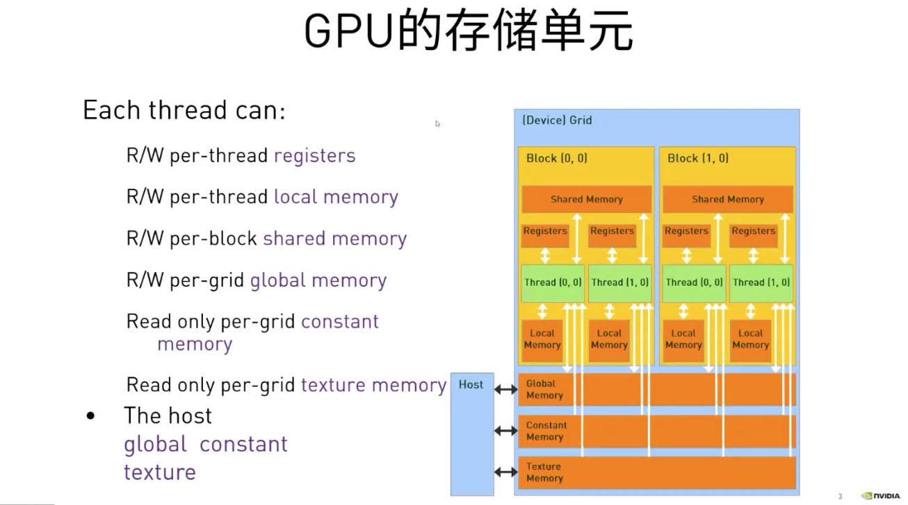

## GPU内存的种类以及每个线程对它的读写权限

1. Register
2. Shared Memory
3. Local Memory
4. Global Memory
5. Constant Memory
6. Texture Memory



<div style="text-align: center;">课件截图</div>


## 内存管理API
```
// CPU
malloc()
memset()
free()

//GPU
cudaMalloc()
cudaMallocManaged()  //申请统一内存
cudaMemset()
cudaFree()

cudaHostAlloc() // for allocating Pinned(Page-locked) memory.

```

## 设备间的数据传输

使用`cudaMemcpy`来进行设备间的数据拷贝


<div style="text-align: center;">课件截图</div>


## 矩阵乘法的例子

对于矩阵乘法，如果使用单核CPU处理器，单线程计算一个 A @ B = C的矩阵乘法

假设 A 为 M * N, B 为 N * K的维度: 

CPU计算所需的时间复杂度为O(M * N * K)

而如果使用GPU进行计算，那么我们可以：
- 每个线程，负责计算C中的一个元素。
- 每个线程，读取A中的一行数据，再读取B中的一列数据。
- 为每一行（i），每一列(j)，中对应的元素执行乘法，并加到一个变量中，作为C[i][j]的值

C矩阵中，对应的行列坐标和线程id的关系如下:

cuda线程排布中, x为水平方向, y为垂直方向 则: 


```c++
    Thread_x(row) = blockIdx.y * blockDim.y + threadIdx.y; 
    Thread_y(col) = blockIdx.x * blockDim.x + threadIdx.x;
```


<div style="text-align: center;">课件截图</div>


## 矩阵乘法代码示例

```c++

__global__ void gpu_matrix_mult(int *a,int *b, int *c, int m, int n, int k)
{ 
    int row = blockIdx.y * blockDim.y + threadIdx.y; 
    int col = blockIdx.x * blockDim.x + threadIdx.x;
    int sum = 0;
    if( col < k && row < m) 
    {
        for(int i = 0; i < n; i++) 
        {
            sum += a[row * n + i] * b[i * k + col];
        }
        c[row * k + col] = sum;
    }
} 

```

## CUDA运行时错误检测

即便不是大多数，也有许多 CUDA 函数（例如，[内存管理函数](http://docs.nvidia.com/cuda/cuda-runtime-api/group__CUDART__MEMORY.html#group__CUDART__MEMORY)）会返回类型为 `cudaError_t` 的值，该值可用于检查调用函数时是否发生错误。以下是对调用 `cudaMallocManaged` 函数执行错误处理的示例：

```cpp
cudaError_t err;
err = cudaMallocManaged(&a, N)                    // Assume the existence of `a` and `N`.

if (err != cudaSuccess)                           // `cudaSuccess` is provided by CUDA.
{
  printf("Error: %s\n", cudaGetErrorString(err)); // `cudaGetErrorString` is provided by CUDA.
}
```

由于cuda的核函数返回类型是void，核函数启动后将不会返回类型为 `cudaError_t` 的值。为检查启动核函数时是否发生错误（例如，如果启动配置错误），CUDA 提供 `cudaGetLastError` 函数，该函数会返回类型为 `cudaError_t` 的值。

最后，为捕捉异步错误（例如，在核函数异步执行期间），请务必检查后续同步 CUDA 运行时 API 调用所返回的状态（例如 `cudaDeviceSynchronize`该函数的返回值也是一个`cudaError_t`类型的值）；如果之前启动的其中一个核函数失败，则将返回错误。


<div style="text-align: center;">课件截图</div>

课程中提供了一个名为`error.cuh`的头文件，定义了一个可以检测CUDA运行时错误的函数，能够帮助我们发现错误。

```cpp
#pragma once
#include <stdio.h>

#define CHECK(call)                                   \
do                                                    \
{                                                     \
    const cudaError_t error_code = call;              \
    if (error_code != cudaSuccess)                    \
    {                                                 \
        printf("CUDA Error:\n");                      \
        printf("    File:       %s\n", __FILE__);     \
        printf("    Line:       %d\n", __LINE__);     \
        printf("    Error code: %d\n", error_code);   \
        printf("    Error text: %s\n",                \
            cudaGetErrorString(error_code));          \
        exit(1);                                      \
    }                                                 \
} while (0)
```

或者NVIDIA官方DLI给出的例程为：

```cpp
#include <stdio.h>
#include <assert.h>

inline cudaError_t checkCuda(cudaError_t result)
{
  if (result != cudaSuccess) {
    fprintf(stderr, "CUDA Runtime Error: %s\n", cudaGetErrorString(result));
    assert(result == cudaSuccess);
  }
  return result;
}

int main()
{

/*
 * The macro can be wrapped around any function returning
 * a value of type `cudaError_t`.
 */

  checkCuda( cudaDeviceSynchronize() )
}
```


## CUDA Event

CUDA Event的本质是一个GPU时间戳，这个时间戳是在用户指定的时间点上记录的。
因CPU和GPU之间是异步的，统计GPU程序的运行时间最好是由GPU上的时钟来作为参考。
由于GPU本身支持时间戳的记录，因此避免了使用CPU定时器来统计GPU执行时间可能遇到的诸多问题。


<div style="text-align: center;">课件截图</div>

代码示例，利用CUDA Event来监测核函数的执行时间

```c++
cudaEvent_t start, stop;
CHECK(cudaEventCreate(&start));
CHECK(cudaEventCreate(&stop));

CHECK(cudaEventRecord(start));
//cudaEventQuery(start);
gpu_matrix_mult<<<dimGrid, dimBlock>>>(d_a, d_b, d_c, m, n, k);    
CHECK(cudaEventRecord(stop));
CHECK(cudaEventSynchronize(stop));
float elapsed_time;
CHECK(cudaEventElapsedTime(&elapsed_time, start, stop));

```

- cudaEventRecord(start):
  将start放到 默认stream中，因为我们没创建stream，所以是在默认stream。
  当这个start到stream的时候，就会在device上记录一个时间戳。
  cudaEventRecord(）视为一条记录当前时间的语句，并且把这条事件放入GPU的未完成队列中。
  因为直到GPU执行完了在调用cudaEventRecord(）之前的所有语句时，事件才会被记录下来。
  
- cudaEventRecord(stop)
  记录到的stop，是device执行完之后才会将事件加入到device。 
  所以cudaEventElapsedTime记录的事件start，和stop的时间就是device在某个stream的执行时间。
  
- cudaEventSynchronize(stop)
  会阻塞CPU，直到特定的event被记录。
  也就是这里会阻塞，直到stop在stream中被记录才会向下执行。
  不使用这句话的话，kernel是异步的，还没执行完，CPU就继续往下走了。
  那么cudaEventElapsedTime就记录不到时间了。
  因为有可能stop事件还没加入到device中。

------

## 使用nsys性能分析器帮助应用程序迭代地进行优化

如要确保优化加速代码库的尝试真正取得成功，唯一方法便是分析应用程序以获取有关其性能的定量信息。`nsys` 是指 NVIDIA 的Nsight System命令行分析器。该分析器附带于CUDA工具包中，提供分析被加速的应用程序性能的强大功能。

`nsys` 使用起来十分简单，最基本用法是向其传递使用 `nvcc` 编译的可执行文件的路径。随后 `nsys` 会继续执行应用程序，并在此之后打印应用程序 GPU 活动的摘要输出、CUDA API 调用以及**统一内存**活动的相关信息。我们稍后会在本实验中详细介绍这一主题。

在加速应用程序或优化已经加速的应用程序时，我们应该采用科学的迭代方法。作出更改后需分析应用程序、做好记录并记录任何重构可能会对性能造成何种影响。尽早且经常进行此类观察通常会让您轻松获得足够的性能提升，以助您发布加速应用程序。此外，经常分析应用程序将使您了解到对 CUDA 代码库作出的特定更改会对其实际性能造成何种影响：而当只在代码库中进行多种更改后再分析应用程序时，将很难得知这一点。

运用 `nsys profile` 分析刚编译好的可执行文件。`nsys profile`将生成一个`qdrep`报告文件，该文件可以以多种方式使用。 我们在这里使用`--stats = true`标志表示我们希望打印输出摘要统计信息。

使用例子为：

```shell
nsys profile --stats=true PATH_TO_EXECUTABLE
```


 输出的信息有很多，包括：

- 配置文件配置详细信息
- 报告文件的生成详细信息
- **CUDA API统计信息**
- **CUDA核函数的统计信息**
- **CUDA内存操作统计信息（时间和大小）**
- 操作系统内核调用接口的统计信息

例如，我们之前的vector_add.cu的例子，使用`nsys profile` 分析后的结果打印如下：

```shell
**** collection configuration ****
	force-overwrite = false
	stop-on-exit = true
	export_sqlite = true
	stats = true
	capture-range = none
	stop-on-range-end = false
	Beta: ftrace events:
	ftrace-keep-user-config = false
	trace-GPU-context-switch = false
	delay = 0 seconds
	duration = 0 seconds
	kill = signal number 15
	inherit-environment = true
	show-output = true
	trace-fork-before-exec = false
	sample_cpu = true
	backtrace_method = LBR
	wait = all
	trace_cublas = false
	trace_cuda = true
	trace_cudnn = false
	trace_nvtx = true
	trace_mpi = false
	trace_openacc = false
	trace_vulkan = false
	trace_opengl = true
	trace_osrt = true
	osrt-threshold = 0 nanoseconds
	cudabacktrace = false
	cudabacktrace-threshold = 0 nanoseconds
	profile_processes = tree
	application command = ./single-thread-vector-add
	application arguments = 
	application working directory = /dli/task
	NVTX profiler range trigger = 
	NVTX profiler domain trigger = 
	environment variables:
	Collecting data...
Success! All values calculated correctly.
	Generating the /dli/task/report1.qdstrm file.
	Capturing raw events...
	4564 total events collected.
	Saving diagnostics...
	Saving qdstrm file to disk...
	Finished saving file.


Importing the qdstrm file using /opt/nvidia/nsight-systems/2019.5.2/host-linux-x64/QdstrmImporter.

Importing...

Importing [==================================================100%]
Saving report to file "/dli/task/report1.qdrep"
Report file saved.
Please discard the qdstrm file and use the qdrep file instead.

Removed /dli/task/report1.qdstrm as it was successfully imported.
Please use the qdrep file instead.

Exporting the qdrep file to SQLite database using /opt/nvidia/nsight-systems/2019.5.2/host-linux-x64/nsys-exporter.

Exporting 4525 events:

0%   10   20   30   40   50   60   70   80   90   100%
|----|----|----|----|----|----|----|----|----|----|
***************************************************

Exported successfully to
/dli/task/report1.sqlite

Generating CUDA API Statistics...
CUDA API Statistics (nanoseconds)

Time(%)      Total Time       Calls         Average         Minimum         Maximum  Name                                                                            
-------  --------------  ----------  --------------  --------------  --------------  --------------------------------------------------------------------------------
   90.5      2307595386           1    2307595386.0      2307595386      2307595386  cudaDeviceSynchronize                                                           
    8.8       224543461           3      74847820.3           19339       224461876  cudaMallocManaged                                                               
    0.7        18243974           3       6081324.7         5461104         7244523  cudaFree                                                                        
    0.0           51349           1         51349.0           51349           51349  cudaLaunchKernel                                                                


Generating CUDA Kernel Statistics...

Generating CUDA Memory Operation Statistics...
CUDA Kernel Statistics (nanoseconds)

Time(%)      Total Time   Instances         Average         Minimum         Maximum  Name                                                                            
-------  --------------  ----------  --------------  --------------  --------------  --------------------------------------------------------------------------------
  100.0      2307581036           1    2307581036.0      2307581036      2307581036  addVectorsInto                                                                  


CUDA Memory Operation Statistics (nanoseconds)

Time(%)      Total Time  Operations         Average         Minimum         Maximum  Name                                                                            
-------  --------------  ----------  --------------  --------------  --------------  --------------------------------------------------------------------------------
   76.6        68338400        2304         29660.8            1888          171360  [CUDA Unified Memory memcpy HtoD]                                               
   23.4        20865248         768         27168.3            1120          159520  [CUDA Unified Memory memcpy DtoH]                                               


CUDA Memory Operation Statistics (KiB)

            Total      Operations            Average            Minimum            Maximum  Name                                                                            
-----------------  --------------  -----------------  -----------------  -----------------  --------------------------------------------------------------------------------
         393216.0            2304              170.7              4.000             1020.0  [CUDA Unified Memory memcpy HtoD]                                               
         131072.0             768              170.7              4.000             1020.0  [CUDA Unified Memory memcpy DtoH]                                               


Generating Operating System Runtime API Statistics...
Operating System Runtime API Statistics (nanoseconds)

Time(%)      Total Time       Calls         Average         Minimum         Maximum  Name                                                                            
-------  --------------  ----------  --------------  --------------  --------------  --------------------------------------------------------------------------------
   59.2      5338328230         273      19554315.9           21010       100126299  poll                                                                            
   39.5      3557093462         272      13077549.5           13517       100073090  sem_timedwait                                                                   
    1.0        93604646         590        158651.9            1082        18591560  ioctl                                                                           
    0.2        20256738          90        225074.9            1225         7181646  mmap                                                                            
    0.0          587355          77          7628.0            2339           19847  open64                                                                          
    0.0          137798           4         34449.5           24499           45148  pthread_create                                                                  
    0.0          110778          23          4816.4            1214           20302  fopen                                                                           
    0.0           91161           3         30387.0           24423           38420  fgets                                                                           
    0.0           83239          11          7567.2            4200           12013  write                                                                           
    0.0           46139          14          3295.6            1085            6891  munmap                                                                          
    0.0           34139           5          6827.8            2517            9446  open                                                                            
    0.0           29187          16          1824.2            1053            3902  fclose                                                                          
    0.0           25800          12          2150.0            1000            5009  read                                                                            
    0.0           14011           2          7005.5            5420            8591  socket                                                                          
    0.0           12518           3          4172.7            3994            4324  pipe2                                                                           
    0.0            7782           2          3891.0            3820            3962  fread                                                                           
    0.0            7360           4          1840.0            1334            2267  mprotect                                                                        
    0.0            6395           1          6395.0            6395            6395  connect                                                                         
    0.0            3955           1          3955.0            3955            3955  fcntl                                                                           
    0.0            2446           1          2446.0            2446            2446  bind                                                                            
    0.0            1496           1          1496.0            1496            1496  listen                                                                          


Generating NVTX Push-Pop Range Statistics...
NVTX Push-Pop Range Statistics (nanoseconds)
```

