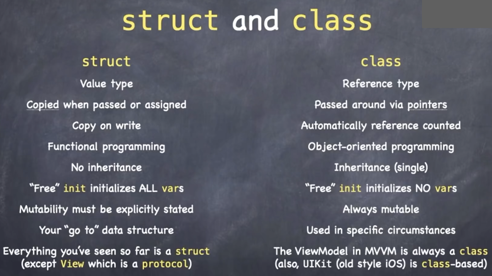

---
layout: post
title: "iOS Development 02: Function, Struct & Class"
author: "Yalun Hu"
categories: journal
tags: [Blog, iOS, Swift]

image: mountains.jpg
--- 

## 函数[Function]

```swift
func functionName(arg1: Type1) -> Type2 {
    ...
    ...
}
```

## 类和结构体对比



Structures and classes in Swift have many things in common. Both can:

- Define properties to store values
- Define methods to provide functionality
- Define subscripts to provide access to their values using subscript syntax
- Define initializers to set up their initial state
- Be extended to expand their functionality beyond a default implementation
- Conform to protocols to provide standard functionality of a certain kind

For more information, see [Properties](https://docs.swift.org/swift-book/documentation/the-swift-programming-language/properties), [Methods](https://docs.swift.org/swift-book/documentation/the-swift-programming-language/methods), [Subscripts](https://docs.swift.org/swift-book/documentation/the-swift-programming-language/subscripts), [Initialization](https://docs.swift.org/swift-book/documentation/the-swift-programming-language/initialization), [Extensions](https://docs.swift.org/swift-book/documentation/the-swift-programming-language/extensions), and [Protocols](https://docs.swift.org/swift-book/documentation/the-swift-programming-language/protocols).

Classes have additional capabilities that structures don’t have:

- Inheritance enables one class to inherit the characteristics of another.
- Type casting enables you to check and interpret the type of a class instance at runtime.
- De-initializers enable an instance of a class to free up any resources it has assigned.
- Reference counting allows more than one reference to a class instance.

For more information, see [Inheritance](https://docs.swift.org/swift-book/documentation/the-swift-programming-language/inheritance), [Type Casting](https://docs.swift.org/swift-book/documentation/the-swift-programming-language/typecasting), [Deinitialization](https://docs.swift.org/swift-book/documentation/the-swift-programming-language/deinitialization), and [Automatic Reference Counting](https://docs.swift.org/swift-book/documentation/the-swift-programming-language/automaticreferencecounting).

