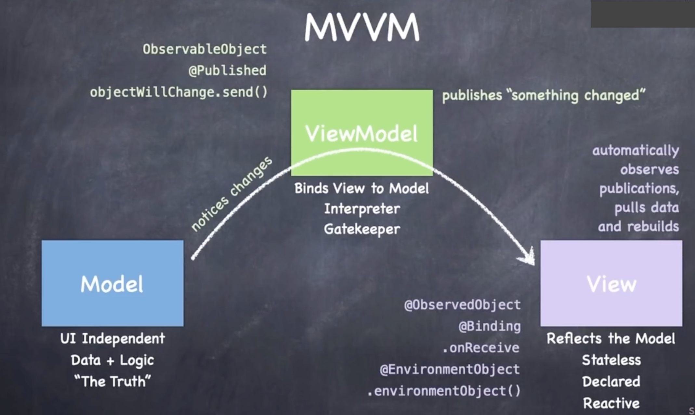

## MVVM设计模式

Model-View-ViewModel is a design paradigm. 

It must be adhered to for SwiftUI to work.

### Model

- UI Independent
- Data + Logic

### View

- The reflection of the Model
- Stateless
- Declared(只有“var body”决定了view是如何绘制的)
- Reactive (Always reacting efficiently to the change on the model)
- Automatically observes publications from ViewModel( or subscribe what they interested at from the ViewModel) .Pulls data and rebuild itself.

### ViewModel

- Binds View to Model(so the change on the model cause the view to react and get rebuilt)
- Interpreter (between Model and View). Help View code stay clean and neat.
- Gatekeeper.  
- Constantly noticing changes in the Model
- Publish a message globally once any change in the Model is noticed (avoid have any connection to any of the View that using it to access the Model)
- Processing User Intent(Change the Model based on the events occurs in the View)

### Rules in MVVM

- The View must always get data from the Model by asking it from the ViewModel.
- The ViewModel never stores the data for the Model in side of itself.

## @State

**View** is Read-Only, So "let/constant properties" or "computed properties" make much sense for a **View**. The **EXCEPTION** is property wrappers like @ObservedObject which must be marked as a "var"