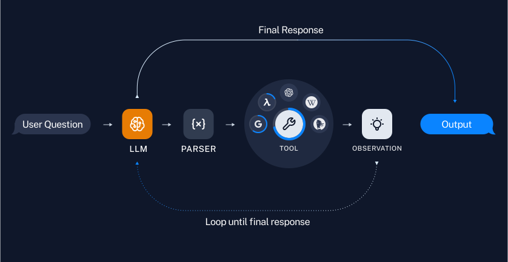
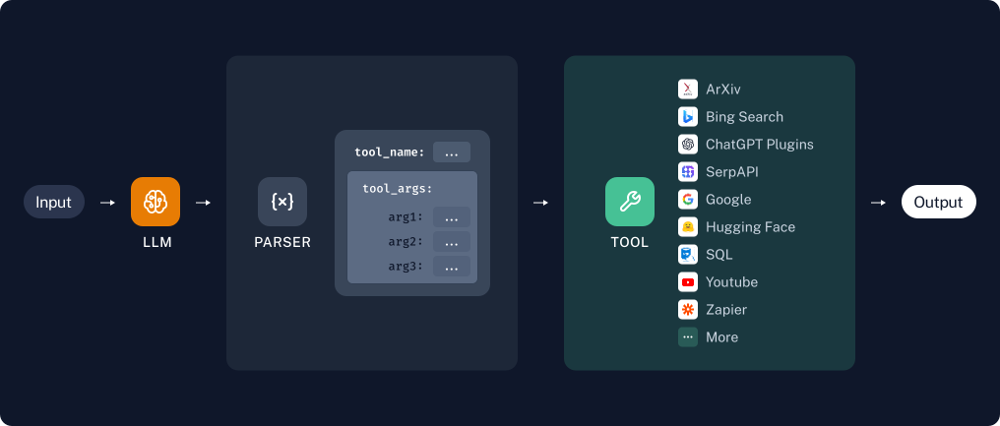

## LangChain Agent简介

Agent的核心理念：“use a language model to choose a sequence of actions to take”。在Chain类的概念中，一系列的action是提前预设好且按照固定顺序执行的，而对于agent来讲，它的后端有一个LLM来根据用户的输入做推理，因此会“选择”action进行执行，并且自行决定执行的顺序。

### Agent流程



### Chain流程




## Agent必要的组件

- Prompt
- LLM
- Tool
- Parser

当前LangChain文档中主流的Agent的构建逻辑基本遵循着以下的流程

1. 初始化prompt, llm, tools, parser
2. 将tools bind到llm上，得到一个叫llm_with_tools的实例
3. 使用LangChain Expression Language来把上述初始化得到的组件组装在一起，得到最后的agent。当然Langchain中的模块也提供了许多形形色色的构建Agent的函数和方法，如何使用还需根据开发者的个人偏好和需求来定。

```python
agent = (
    {
        "input": lambda x: x["input"],
        "agent_scratchpad": lambda x: format_to_openai_tool_messages(
            x["intermediate_steps"]
        ),
    }
    | prompt  # prompt
    | llm_with_tools # llm_with_tools
    | OpenAIToolsAgentOutputParser() # parser
)
```

而对于Agent来说，上述的每一个组件都对它非常重要，但本人认为最重要的两项是prompt与parser，特别是如果想要自己的Agent的情况下，好的prompt以及优秀的parser的逻辑应该能对Agent的表现产生至关重要的影响。
