---

layout: post
title: "从语义表示到RAG: Embedding的前世今生"
author: "Yalun Hu"
categories: journal
tags: [Blog, NLP, LLM, Embedding]
image: 2024-07-28-nlp-embedding/cover.jpeg

---

## 前言

当今如火如荼的大语言模型应用领域，向量数据库的使用几乎无处不在。文本类向量数据库中的每一条向量，是由一段文本经某种算法映射后所表示而成的。那么，文本是如何被表示成向量的呢？我们该如何训练一个能够实现 “文本 ---> 向量” 这一功能的神经网络模型呢？这篇文章将为你进行逐一解答。

## 词嵌入(Word Embedding)简介

### 单词的数字表示

在处理自然语言类型的机器学习任务时，首先需要思考的问题就是：**如何将字符串文本表示为数字？**

### One-Hot Encoding

最初，单词被表示为它在一个词典中的索引（index）。比如一个语料库中一共有1000个单词，"language"这个单词在词典中排第200个，那么它可以被表示为一个独热向量（one-hot vector），即一个维度为1000，其第200个元素的值为1，其它所有元素均为0的向量。one-hot编码的特点是：简单，高维度，稀疏，离散，维度由词典大小决定，单词间的表示无相似性度量（无语义）。

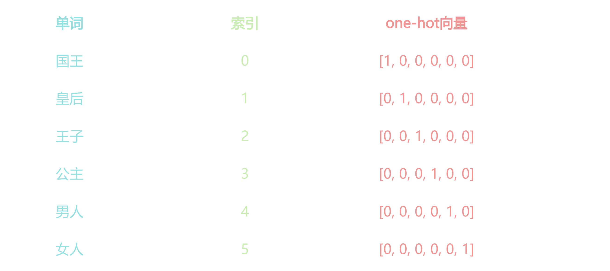

### 什么是词嵌入（Word Embedding）

Word Embedding可被看作一种映射（mapping）：将单词（word）看作一段文本的基础单元，将某个单词的one-hot vector/或者index，通过一定的方法，**映射或嵌入**到一个向量空间的过程。之所以被称为嵌入，是因为这个映射通常伴随着向量的降维，例如语料库的词典大小通常有几十万的单词，但是最后embedding得到的词向量维度往往是几百或者几千这样的维度。Word Embedding的特点是，低维度，稠密，连续（浮点型），能够捕捉单词间的相似度。

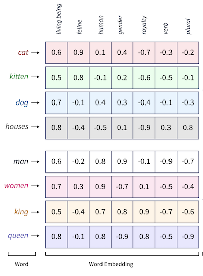

词嵌入也有很多相关的算法，但在当时最为主流的主要是以下两个：

- **Word2Vec**（神经网络派）
- GloVe(Global Vectors for Word Representation)（统计优化派）

由于Word2Vec对后面NLP中词向量的表示产生了非常广泛和深远的影响，所以我们会在此着重进行介绍。

### Word2Vec

Word2Vec来自于2013年谷歌研究团队的一篇paper: [“Efficient Estimation of Word Representations in Vector Space”](https://arxiv.org/abs/1301.3781)。它旨在通过从大型文本语料库中学习来捕捉单词之间的语义关系（单词的相似度）。

有趣的是，该paper当年被顶会ICLR 2013拒了，但目前该paper的引用量已有4万多。

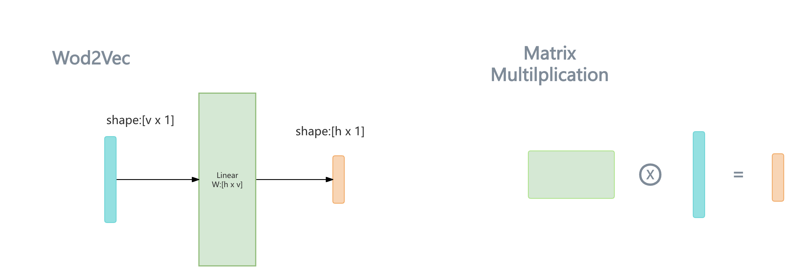

利用Word2Vec得到word embedding向量的过程非常简单，仅仅是做一个 矩阵与向量的乘法 操作：

将代表某个单词的one-hot向量
$$
{\vec {i}}_{[v \times 1]}
$$
作为输入，输入到一个训练好的单层的神经网络Linear层。

Linear层的作用十分简单，就是将输入的向量，乘上一个矩阵，相当于对输入向量做一个线性变换，假设矩阵为：
$$
\mathbf{W}_{[h \times v]}
$$

经由该层的线性映射，可以得到一个低维度的向量
$$
{\vec {e}}_{[h \times 1]} \space \space_{v >> h}
$$
这个低维度的向量
$$
{\vec {e}}_{[h \times 1]}
$$
便是word embedding向量。

$$
{\vec {e}}_{[h \times 1]} = \mathbf{W}_{[h \times v]} \cdot {\vec {i}}_{[v \times 1]}\\
$$

你或许已经发现，**使用一个矩阵对一个one-hot向量进行线性变换，等同于抽取出该矩阵的一列，抽取的列的序号，正是one-hot向量中，元素1所在的行索引值**。

这不仅省去了大量的与0元素相乘的冗余的计算，也能够将输入从一个高维的one-hot向量简化成单词在字典中的整数索引，这正是当前PyTorch或者其他流行的深度学习框架中，nn.Embedding layer的基本实现原理。

$$
\left[
\begin{matrix}
w_{12} \\
w_{22} \\
... \\
w_{h2}
\end{matrix}
\right]
	= 
\left[
\begin{matrix}
w_{11} & w_{12} & ... & w_{1v} \\
w_{21} & w_{22} & ... & w_{2v} \\
... & ... & ... & ...\\
w_{h1} & w_{h2} & ... & w_{hv} \\
\end{matrix}
\right]

\cdot

\left[
\begin{matrix}
0 \\
1 \\
...\\
0 \\
\end{matrix}
\right]
$$

接下来值得思考的问题便是：矩阵
$$
\mathbf{W}_{[h \times v]}
$$
是如何通过训练来得到的？

### Word2Vec的训练
在Word2Vec的paper中，主要提出了两种相似却略有不同的训练方式：
- CBOW（ Continuous Bag of Words）
- Skip-Gram
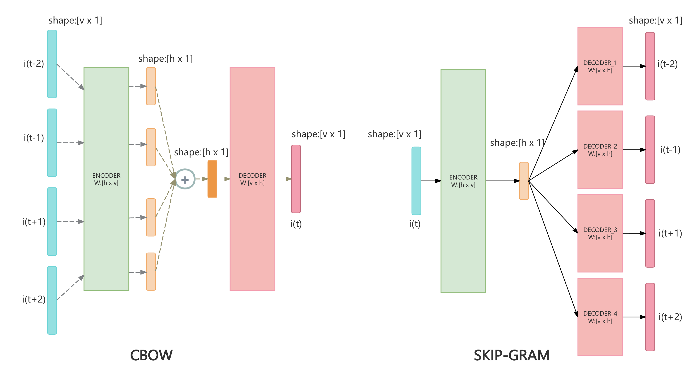
简单来讲，CBOW会训练一个简单的两层MLP进行分类任务，它以一个中心单词周围的几个词（$${\vec {i}}_{t-2}, {\vec {i}}_{t-1}, {\vec {i}}_{t+1}, {\vec {i}}_{t+2}$$）作为输入，预测该中心单词（$${\vec {i}}_{t}$$)。作为输入的one-hot向量们，经由同一个Linear Encoder的映射后，求和，再由另一个Linear Decoder映射回和one-hot向量相同的维度，最后进行softmax转化为概率分布，最后进行交叉熵计算loss。

相反的，Skip-Gram是以中心词作为输入，预测它周围的几个词。

当训练收敛后，我们移除Decoder（图中粉色的部分），保留Encoder（图中绿色的部分）便得到了一个能够进行词嵌入的embedding layer，前面提到的用于做embedding映射的矩阵，便是该Encoder的权重矩阵（weight matrix）。

### Word Embedding的优缺点

优点1: 当时的语言模型在进行训练前，常常会先用Word2Vec的方式对模型中的embedding-layer进行预训练，以预训练好的embedding layer的值作为初始值再进行后续其它任务的训练，这一过程被称为"pretraining-embedding"，它通常能够提升模型表现。

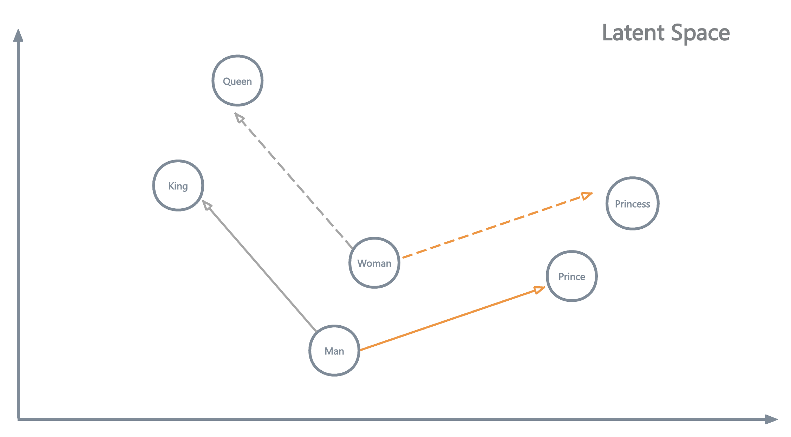

优点2：Word Embedding向量为单词提供了语义表征（semantics representation），即意思相近的单词，在embedding后的h维的高维空间中会具有较为相近的欧几里得距离 或者 较高的余弦相似度。这是使用one-hot表示无法做到的。

$$
Distance1_{Euc_1} = \sqrt[2] {(\vec{cat} - \vec{kitty})^{2}} = 0.1 \\
Distance_{Euc_2} = \sqrt[2] {(\vec{cat} - \vec{apple})^{2}} = 2.96
$$

$$
Similarity_{Cos_1} = \frac{\vec{cat} \cdot \vec{kitty}} {\Vert \vec{cat} \Vert \times \Vert \vec{kitty} \Vert} = 0.95 \\
Similarity_{Cos_2} = \frac{\vec{cat} \cdot \vec{apple}} {\Vert \vec{cat} \Vert \times \Vert \vec{apple} \Vert} = -0.02 \\
$$

优点3：一个有趣的现象为，Word Embedding向量为单词间提供了“算术运算”的可能性。这也是word embedding能够进行语义表征的直接体现。

$$
{\vec {King}} - {\vec {Man}} + {\vec {Woman}} \approx {\vec {Queen}}
$$

缺点：Word2Vec是根据整体语料库中单词的分布来捕获到单词间的语义，然而同一个单词在不同的句子的 上下文（context）中，会有不同的意思， 例如：

- "bank of the river" (此处的bank代表着 河床 的意思)
- "I access my bank account" (此处的bank代表着 银行 的意思)

然而对于Word2Vec这样的"Context-Free"的模型，它针对这两句话中的bank都只能给出相同的表示，**这两个bank都对应着训练好的Embedding层矩阵中的同一列**。

## 句子嵌入(Sentence Embedding)简介

上面的介绍中，我们知道了如何将句子中的每一个单词表示为一个embedding向量，但是熟悉 RAG/向量数据库 的同学们或许知道，向量数据库中的一条向量往往代表着一个完整的句子或者一大段文本，句子或文本段落有长有短，它们又是如何被表示成一个个具有相同维度的embedding向量的呢？

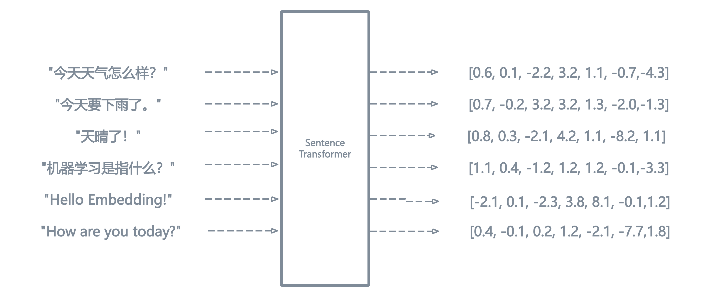

最简单的，我们可以对句子中所有的单词的embedding向量求均值（average word embedding），这样我们也能得到关于一个句子的sentence embedding向量。
$$
\vec{S} = (\vec{w_{1}} + \vec{w_{2}} + \space ... + \space \vec{w_{n}}) / n
$$

但是这样的方法是有问题的，例如对于如下的两个句子，它们具有完全相反的含义，然而如果使用average word embedding的方案，它们将会得到一模一样的向量表示。

- I have no money.
- No, I have money.

在Transformer的时代到来之前，较为流行的Sentence Embedding的方式有：Skip-Thought Vectors 以及 InferSent。它们的核心思想是利用RNN来 捕获 并 融合 出一个综合了整个句子的上下文信息的向量。但随着2017年的paper “Attention Is All You Need” 的出现，sentence embedding的风向基本都转向了基于Transformer的模型架构。

### Sentence Transformers
使用Transformer类模型来获取sentence embedding向量的方案，当前大都被称为[Sentence Transformers](https://sbert.net/)。比较经典的模型有：
- Sentence BERT (S-BERT)
- Universal Sentence Encoder (USE)
- 以及中文社区的 BGE系列模型 和 M3E系列模型
后续我们将以S-BERT模型作为我们解析的用例模型。

### BERT架构简介

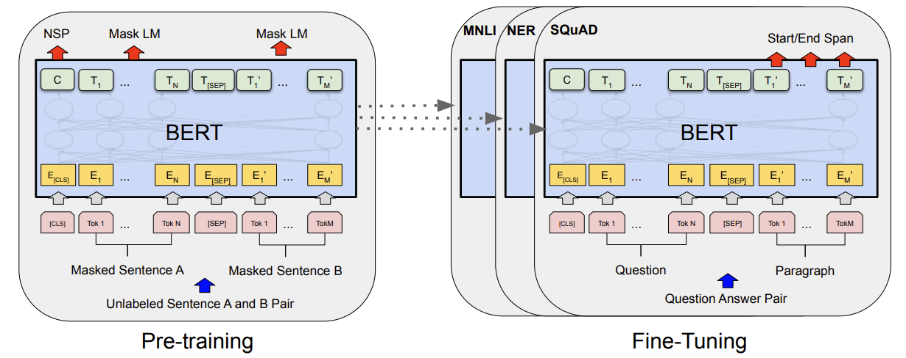

BERT是encoder-only的Transformer架构，在此为了理解方便，不会深扒Transformer的细节，而是从宏观，抽象的“输入和输出分别是什么”来对BERT进行介绍。

#### BERT的输入：
通常是 一对句子 ，假设为句子A和句子B。（也可以是一个单句）。句子们经过分词器（Tokenizer）后，变为了一个个的token，为了方便理解，可以暂时将一个token看作是一个单词。

假设句子A分词后包含N个单词，句子B分词后包含M个单词。此外在每对句子的开头，会填充一个特殊的 [CLS] token，在句子的分隔处个结束处，也会填充一个特殊的 [SEP] token，因此我们会得到M+N+3个token。

前面我们提到过，单词首先会被表示为它在词典中的索引（index）或者是one-hot向量，这是由文本到数字表示的第一步。下面公式中的W即代表的是token/单词在词典中的索引值。

$$
\scriptsize{[S_{A}, S_{B}]} \rightarrow \textbf{Tokenizer} \rightarrow \scriptsize{[W_{[CLS]}, W_{A_{1}}, W_{A_{2}},...,W_{A_{N}}, \space W_{[SEP]}, \space W_{B_{1}}, W_{B_{2}},...,W_{B_{M}}, W_{[SEP]}]}
$$

这些 单词 / token 在正式输入到transformer的encoding layer前，还会被一些预处理层进行转换：

- 将每个单词的索引值，输入到一个word-embedding layer中（前面提到的Word2Vec），根据索引值，抽取word-embedding矩阵的一列，得到每个单词的word-embedding/token-embedding向量，表示该单词在语料库分布中的语义。
- 为每个单词赋予一个，segment-embedding向量，这个向量用来代表该单词它属于句子A还是句子B。
- 为每个单词赋予一个，position-embedding向量，这个向量用来表示每个单词在整个句子中的位置信息。
上述提到的三种向量，均拥有相同的维度，因此它们三个可以被相加，它们相加后，形成了最终transformer模型的输入。此处，我们得到了 M+N+3 个向量作为输入。
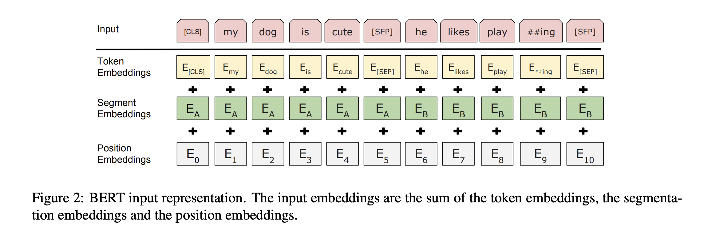

#### BERT的输出：

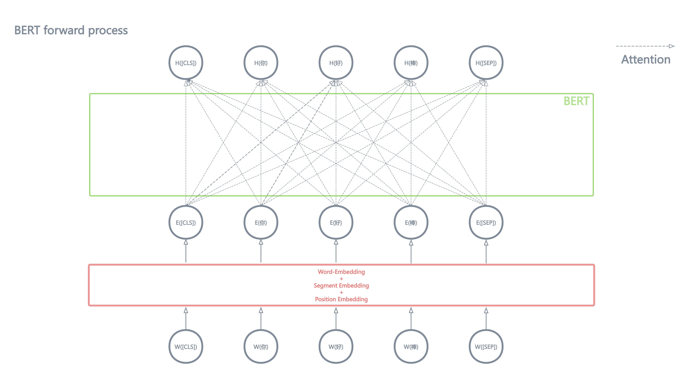

BERT的输出形式非常简单，作为encoder-only的transformer，接收X个向量作为输入，就会输出X个向量。在上面提到的例子中，它会输出 M+N+3 个向量。注意，此处输出的X个向量的维度，可能和输入向量的维度不同。

由于Transformer的Attention机制的缘故，输出的每个向量，都融合了整个句子的上下文信息（context）。此处不对Attention计算的细节做深度描述。

总之，Attention的运算机制使得BERT输出的每个向量，都融合了整个句子的上下文信息。(可以参考下图中的那些箭头，就是在描述Attention捕捉并融合整个句子上下文信息的过程。)。

通常，**我们把BERT输出的向量成为 隐向量 （Hidden Vector/Latent Vector）**，因为我们认为神经网络模型将输入的向量映射到了一个新的向量空间，被称为 **隐空间 （Latent Space）。**

$$
\scriptsize{[W_{[CLS]}, W_{A_{1}},...,W_{A_{N}}, W_{[SEP]}, W_{B_{1}},...,W_{B_{M}}, W_{[SEP]}]} \rightarrow \textbf{BERT} \rightarrow \scriptsize{[H_{[CLS]}, H_{A_{1}},...,H_{A_{N}}, H_{[SEP]}, H_{B_{1}},...,H_{B_{M}}, H_{[SEP]}]}
$$

#### 思考：
对于句子嵌入问题（sentence embedding）我们的目的是：给定一个句子/一段文本，用一个固定维度的向量表示这段文本的语义。

现在，得益于Attention，BERT输出的每个 隐向量（${\vec{H}}_{[h \times 1]}$） 都融合了句子的上下文信息，那么可不可以用某一个 输出的隐向量 作为表示整个句子语义的sentence-embedding呢？再或者，我把这些个隐向量求一个均值，把这个均值向量作为作为表示整个句子语义的sentence-embedding呢？

**答案是，可以！并且后面要介绍的 Sentence-BERT 就是沿着这个思路走的！**

并且BERT诞生的初期，有人以[CLS] token所对应输出的隐向量$H_{[CLS]}$作为sentence-embedding。但是，BERT在做 句子语义表示的任务 上没有被青睐，一是BERT做语义相似度计算的效率不高，二是效果不好。至于原因，我们接着往下看。

### 从BERT到Sentence-BERT

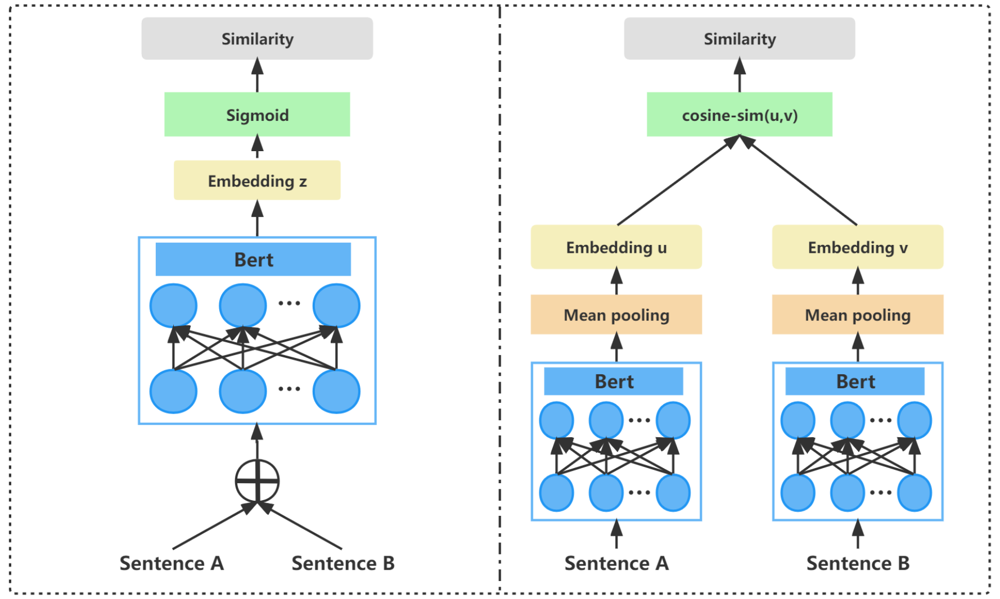

#### BERT在 semantic textual similarity 任务上的缺陷
- 计算效率低下：
	BERT在计算两个句子的相似度时，需要将两个句子拼接后输入给模型。

	那么，对于每一个新来的句子（query），为了获得数据库中与之语义最相似的句子，我们必须把数据库中的句子和query句子组合在一起，输入给模型并得到相似度的估计。这个效率是非常低下的，因为需要模型进行大量的 前向计算。
- 语义表示效果不好：
  	BERT的训练没有加入专门的 损失函数/目标函数（loss/objective function）来提升sentence embedding vector的语义表示效果。
  
#### Sentence-BERT(S-BERT)

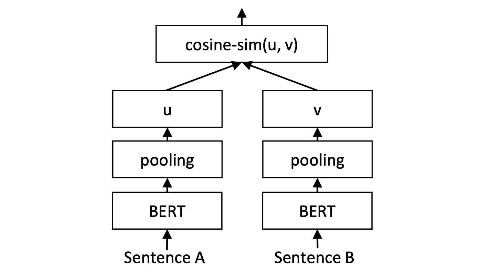

类似前文提到的，Sentence-BERT 将模型输出的 隐向量（$$[{\vec{H}}_{0}, {\vec{H}}_{1}, ...,{\vec{H}}_{n}]$$）求一个均值，把这个均值向量作为作为表示整个句子语义的sentence-embedding。这个求均值的操作，在模型中一个叫做"pooling"的层中被执行。

Sentence-BERT的 网络结构 和 输入形式 使得模型可以预先计算和存储句子的嵌入表示（embedding vector）。当需要计算两个句子的相似度时，只需比较它们的嵌入向量即可，大大减少了计算开销。

此外，为了提升语义表示的能力，S-BERT在训练中加入了特定的训练数据，并针对地设计了相应的 损失函数。所以接下来，我们将进一步深究 S-BERT 是如何被训练出来的。

### S-BERT的训练
#### 分类损失
数据组成：
- 输入：两个句子（A,B）组成的句子对（sentence pair）
- 标签：三分类标签，表示句子对中的两个句子的语义关系是：蕴涵[0]、矛盾[1]、中性[2]。

训练步骤：
1. 将两个句子对 (A, B) 通过共享参数（同样参数）的BERT编码器生成各自的句子嵌入$${\vec{u}}_{[h \times 1]}$$和$${\vec{v}}_{[h \times 1]}$$。
2. 将这两个嵌入向量以及它们的 差值 拼接起来，形成一个特征向量$${\vec{z}}_{[3h \times 1]}$$，其中$$\vec{z} = concat([\vec{u}, \vec{v}, \lvert \vec{u} - \vec{v} \rvert])$$。
3. 将特征向量$${\vec{z}}_{[3h \times 1]}$$输入一个Linear层，即令向量$${\vec{z}}_{[3h \times 1]}$$乘上一个矩阵$${\mathbf{W}}_{[3 \times 3h]}$$，得到分类用的输出向量$${\vec{y^{'}}}_{[3 \times 1]}$$。
4. 计算$${\vec{y^{'}}}_{[3 \times 1]}$$ 与类别标签 $$\vec{y}$$ 的交叉熵 $$\textbf{CrossEntropy}(\vec{y}, \vec{y^{'}})$$，最后根据交叉熵求梯度，并更新参数。

#### 三元组损失 (Triplet Loss)
Triplet Loss可以很好的 “推远不同语义的sentence embedding之间的距离，拉近相似语义的sentence embedding的距离。” 曾广泛的使用于人脸识别任务中。

数据组成：
- 输入：三个句子组成的三元组（锚点样本Anchor, 正样本Positive, 负样本Negative）。Anchor和Positive有相似的语义，而Anchor和Negative有相反或无关的语义。

训练步骤：
1. 将三个句子对(A, P, N) 通过共享参数（同样参数）的BERT编码器生成各自的句子嵌入向量$${\vec{a}}_{[h \times 1]}$$和$${\vec{p}}_{[h \times 1]}$$和$${\vec{n}}_{[h \times 1]}$$。
2. 直接使用三个句子的嵌入向量计算Triplet Loss损失, 最后根据损失求梯度，并更新模型参数$\theta$，公式如下。

$$
TripletLoss = \mathop{\arg\min}\limits_{\theta}({\max{(0, \Vert \vec{a} - \vec{p} \Vert - \Vert \vec{a} - \vec{n} \Vert + margin)}})
$$

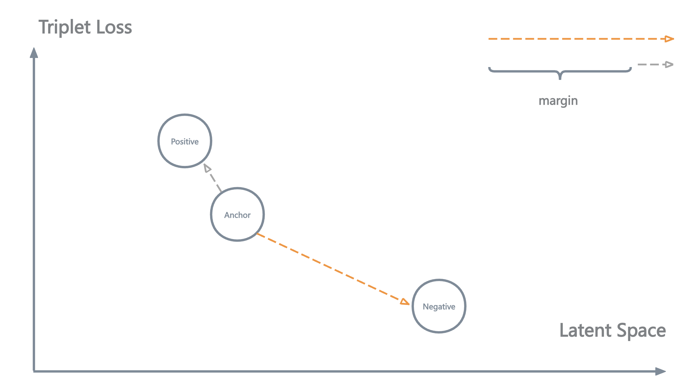

形象的看，三元组损失的优化目标为：

使 锚点样本Anchor 与 正样本Positive 之间的距离 小于 锚点样本Anchor 与  负样本Negative 之间的距离。如果这个距离的差值超过了一个人为设置的距离限制（margin）,那便不再继续优化（惩罚）模型，防止过拟合。

### S-BERT总结
总体看来， 相比于BERT：
- S-BERT更改了输入的形式以及网络结构，使得句子嵌入向量的相似度的计算效率提升很多。
- 针对语义表示性能提升设计的 训练数据集 以及 损失函数 使得句子语义表示的能力得到提升。

## 从sentence-embedding到向量数据库
当训练好了一个sentence transformer后，我们便能使用它来为我们构建向量数据库了。大致的步骤为：

1. 切分文本语料为多个chunk。
2. 将每个chunk输入到我们训练好的 sentence transformer中（例如S-BERT），得到每个chunk的embedding向量。
3. 将所有的chunk的embedding向量存储到数据库中。

至此，我们便得到了一个向量数据库！

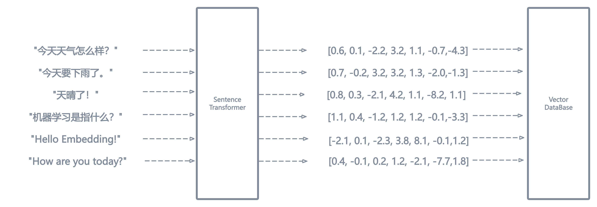

[TODO] 

- [ ] 三元组loss的示意图。

## Evaulation Metrics

## 向量数据库

