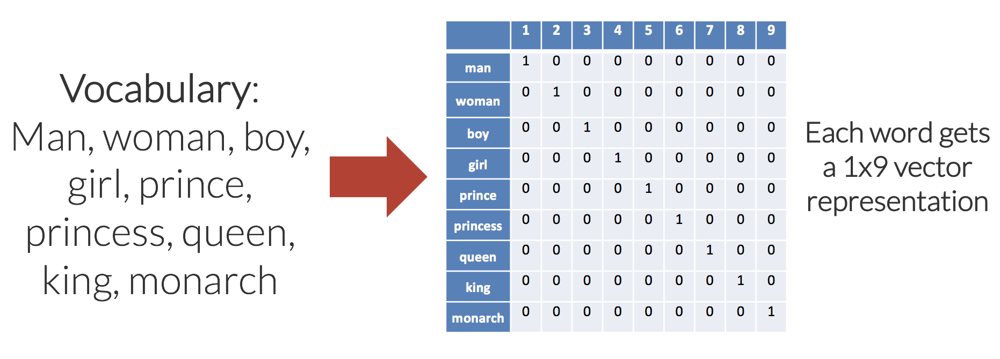
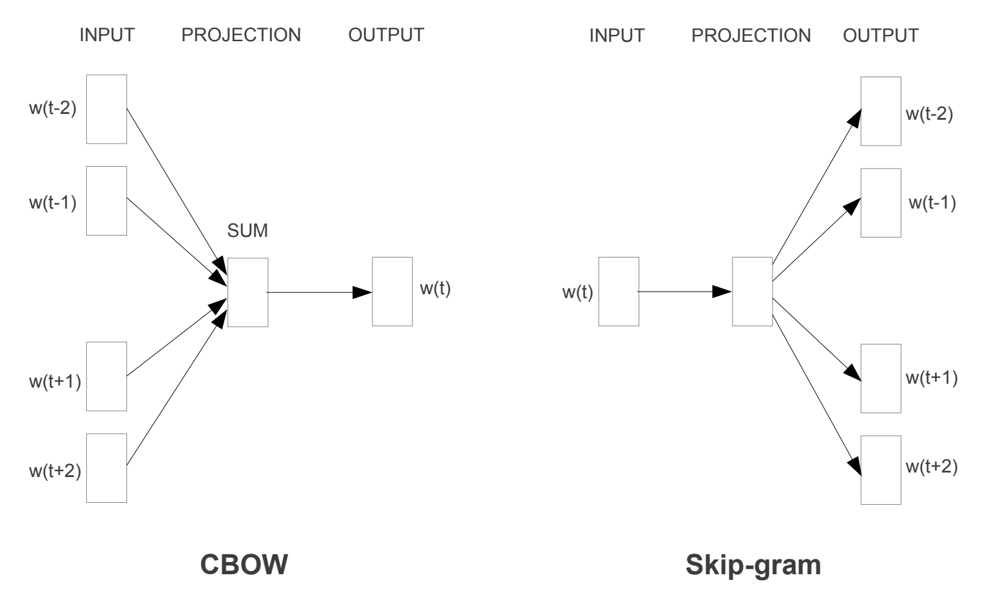

---

layout: post
title: "From Sementic Representation to RAG: The Story of Embedding"
author: "Yalun Hu"
categories: journal
tags: [Blog, NLP, LLM, Embedding]
image: 2024-04-13-langchain-agent/cover.jpeg

---

## 词嵌入(Word Embedding)简介

### 单词的数字表示

在处理自然语言类型的机器学习任务时，首先需要思考的问题就是：**如何将字符串文本表示为数字？**

### One-Hot Encoding

最初，单词被表示为它在一个词典中的索引（index）。比如一个语料库中一共有1000个单词，"language"这个单词在词典中排第200个，那么它可以被表示为一个独热向量（one-hot vector），即一个维度为1000，其第200个元素的值为1，其它所有元素均为0的向量。one-hot编码的特点是：简单，高维度，稀疏，离散，单词间无相似性（无语义）。

### 什么是词嵌入（Word Embedding）

Word Embedding可被看作一种映射（mapping）：将单词（word）看作一段文本的基础单元，将某个单词的one-hot vector/或者index，通过一定的方法，**映射或嵌入**到一个向量空间的过程。之所以被称为嵌入，是因为这个映射通常伴随着向量的降维，例如语料库的词典大小通常有几十万的单词，但是最后embedding得到的词向量维度往往是几百或者几千这样的维度。Word Embedding的特点是，低维度，稠密，连续，能够捕捉单词间的相似度。

词嵌入也有很多相关的算法，但在当时最为主流的主要是以下两个：

- **Word2Vec**（神经网络派）
- GloVe(Global Vectors for Word Representation)（统计优化派）

由于Word2Vec对后面NLP中词向量的表示产生了非常广泛和深远的影响，所以我们会在此着重进行介绍。

### Word2Vec

Word2Vec来自于2013年谷歌研究团队的一篇paper: [“Efficient Estimation of Word Representations in Vector Space”](https://arxiv.org/abs/1301.3781)。它旨在通过从大型文本语料库中学习来捕捉单词之间的语义关系（单词的相似度）。

利用Word2Vec得到word embedding向量的过程非常简单：将代表某个单词的one-hot向量
$$
{\vec {i}}_{[v \times 1]}
$$
作为输入，输入到一个训练好的单层的神经网络Linear层
$$
\mathbf{W}_{[h \times v]}
$$
中，经由该层的线性映射，可以得到一个低维度的向量
$$
{\vec {e}}_{[h \times 1]}
$$
这个低维度的向量
$$
{\vec {e}}_{[h \times 1]}
$$
便是word embedding向量。

$$
{\vec {e}}_{[h \times 1]} = \mathbf{W}_{[h \times v]} \cdot {\vec {i}}_{[v \times 1]}\\
$$

你或许已经发现，**使用一个矩阵对一个one-hot向量进行线性变换，等同于抽取出该矩阵的一列，抽取的列的序号，正是one-hot向量中，元素1所在的行索引值**。这不仅省去了大量的与0元素相乘的冗余的计算，也能够将输入从一个高维的one-hot向量简化成单词在字典中的整数索引，这正是当前PyTorch或者其他流行的深度学习框架中，nn.Embedding layer的基本实现原理。

$$
\left[
\begin{matrix}
w_{12} \\
w_{22} \\
... \\
w_{h2}
\end{matrix}
\right]
	= 
\left[
\begin{matrix}
w_{11} & w_{12} & ... & w_{1v} \\
w_{21} & w_{22} & ... & w_{2v} \\
... & ... & ... & ...\\
w_{h1} & w_{h2} & ... & w_{hv} \\
\end{matrix}
\right]

\cdot

\left[
\begin{matrix}
0 \\
1 \\
...\\
0 \\
\end{matrix}
\right]
$$

接下来值得思考的问题便是：矩阵
$$
\mathbf{W}_{[h \times v]}
$$
是如何通过训练来得到的？

### Word2Vec的训练
在Word2Vec的paper中，主要提出了两种相似却略有不同的训练方式：
- CBOW（ Continuous Bag of Words）
- Skip-Gram

简单来讲，CBOW会训练一个简单的两层MLP进行分类任务，它以一个中心单词周围的几个词（$${\vec {i}}^{t-2}, {\vec {i}}^{t-1}, {\vec {i}}^{t+1}, {\vec {i}}^{t+2}$$）作为输入，预测该中心单词（$${\vec {i}}^{t}$$）。作为输入的one-hot向量们，经由同一个Linear层（这个层就是前面提到的word embedding时用的矩阵）的映射后，求和，再由另一个Linear层映射回和one-hot向量相同的维度，最后进行softmax转化为概率分布，最后进行交叉熵计算loss。

相反的，Skip-Gram是以中心词作为输入，预测它周围的几个词。

当训练收敛后，我们取两层MLP中的第一层（即对输入的one-hot进行映射的那一层），便得到了一个能够进行词嵌入的embedding layer。

### WordEmbedding的好处
当时的语言模型在进行训练前，常常会先用CBOW对模型中的embedding-layer进行预训练，以预训练好的embedding layer的值作为初始值再进行后续其它任务的训练，这一过程被称为"pretraining-embedding"，通常能够为最终的模型表现进行提升。

## Sentence Embedding简介

## Evaulation Metrics

## 向量数据库

